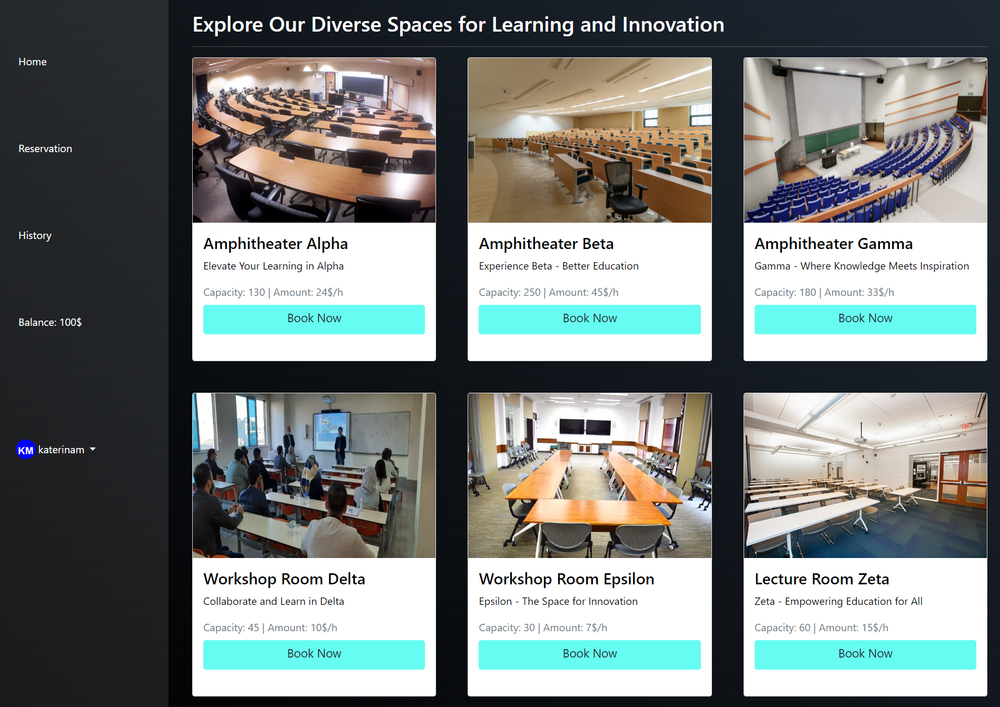

# UniVenue - Room Reservation Management System
UniVenue is a comprehensive Room Reservation Management System designed to streamline the booking process for various facilities within an organization, ensuring efficient space utilization and enhanced user experience.The primary objective of UniVenue is to develop a fully-responsive robust web-based application that simplifies room reservations, allowing users to view available rooms, make bookings, manage their accounts, and receive notifications for booking confirmations and reminders.

## Course Information

UniVenue is developed as part of the CS351 course on Information System Analysis and Design, offered by the Computer Science Department (CSD) at the University of Crete (UoC).

    
    

## Features

- **User Authentication and Registration:** Secure login and registration functionality.
- **Room Information and Reviews:** Detailed room descriptions and user reviews.
- **Booking Management:** Intuitive calendar view for checking availability, making reservations, and modifying bookings.
- **Purchase History:** Users can track their booking history and view past purchases.
- **Administrator Functionality:** Admin users have privileges to approve bookings and manage data.
- **Notifications:** Automated notifications for booking confirmations and reminders.

## Additional Features

- **Login and Register Functionality:** Secure authentication mechanisms.
- **Booking and Cancellation:** Seamless booking process with cancellation options.
- **Administrator Controls:** Privileged access for managing bookings and data.
- **Notifications:** Automated reminders for users.

## Installation and Setup
You can follow the pdf report in this repo.

## Usage
Once the application is deployed and running, users can:

- Register or login to their accounts.
- View available rooms and their details.
- Make reservations and manage bookings.
- Track booking history and past purchases.

Admin users can also:

- Approve bookings.
- Manage room and user data.

    

